<!-- animated header — edit assets/header.svg to customize (guide inside the file) -->
<div align="center">
  
</div>

<br/>

## About Me

> **`nandani@github:~/profile`** Computer Science undergrad at **NIT Patna**.
> I build full-stack things with the MERN stack, obsess over **data structures & algorithms**,
> and I'm currently teaching machines to learn.

<div align="center">
  
  
  
  
</div>

<br/>

## Tech Stack

| | |
|---|---|
| **Languages** |    |
| **Frontend** |    |
| **Backend** |   |
| **Databases** |   |
| **Tools** |    |
| **Learning** |   |

<br/>

## Currently Running

```text
USER      PID   %CPU  %BRAIN  STATUS    COMMAND
nandani   0001  99.9   95.0   running   deep-learning --mode=obsessed
nandani   0002  42.0   80.0   running   neural-networks --backprop
nandani   0003  13.3   60.0   sleeping  dsa-grind --daily --leetcode
```

<br/>

## GitHub Stats

<div align="center">
  
  
</div>

<br/>

<div align="center">
  
</div>

<br/>

<div align="center">
  
</div>

<br/>

<div align="center">
  
</div>

<br/>

## Connect With Me

<div align="center">
  <a href="https://www.linkedin.com/in/nandani-awase"></a>
  <a href="mailto:nandaniawase@gmail.com"></a>
  <a href="https://kaggle.com/nandaniawase"></a>
  <a href="https://instagram.com/nndni.a"></a>
  <a href="https://discord.gg/nandaniawase"></a>
</div>

<br/>

<div align="center">
  
</div>
